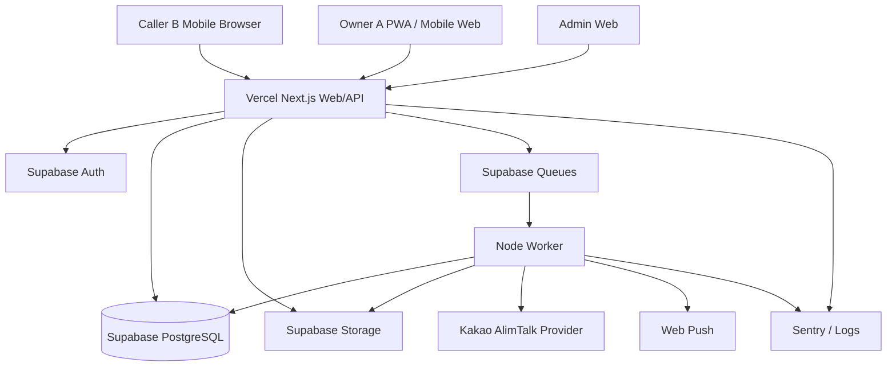

# TAPTOLK MASTER DEVELOPMENT SPECIFICATION

**문서명:** Taptolk QR 기반 익명 차량 커뮤니케이션 플랫폼 통합 개발 명세서  
**문서 목적:** Codex가 별도의 추측 없이 프론트엔드, 백엔드, 데이터베이스, 관리자 시스템, QR 발행·렌더링·배포, 차주 인증, 익명 연락 세션, 보안, 테스트와 배포까지 단계적으로 구현하기 위한 단일 기준 문서  
**작성 기준:** 2026-07  
**문서 버전:** 1.1
**개발 방식:** GitHub Monorepo + Vercel + Supabase PostgreSQL  
**우선 출시 대상:** 국내 아파트 관리회사·관리사무소 B2B 파일럿  
**언어:** 사용자 UI는 한국어 우선, 코드·DB·API 식별자는 영어 사용

---

## 0. CODEX EXECUTION CONTRACT

이 문서는 프로젝트의 최상위 개발 기준이다. Codex는 아래 규칙을 반드시 준수한다.

### 0.1 절대 규칙

1. 임의로 범위를 축소하거나 기능을 삭제하지 않는다.
2. 문서에서 `MVP 필수`로 지정한 기능은 Mock UI가 아니라 실제 데이터 흐름으로 구현한다.
3. 비즈니스 로직을 React 컴포넌트나 Route Handler에 직접 누적하지 않는다.
4. 모든 주요 상태 변경은 Application Service와 DB Transaction을 통해 처리한다.
5. 브라우저에 Supabase Secret Key, Service Role Key, DB URL, 알림 Provider Secret을 노출하지 않는다.
6. QR 공개 토큰, 활성화 코드, OTP, 응답 토큰을 로그에 출력하지 않는다.
7. 테넌트 데이터 격리를 프론트엔드 필터에 의존하지 않는다.
8. 모든 관리자 데이터 조회와 변경은 백엔드 권한 검사를 통과해야 한다.
9. 폐기된 QR, 종료된 Binding, 만료된 Session은 물리 삭제하지 않는다.
10. 개발 편의를 이유로 RLS를 비활성화한 상태로 완료 처리하지 않는다.
11. 외부 카카오 알림톡 계약·템플릿·자격증명이 없을 때 Provider 경계를 생략하지 말고
    비프로덕션 전용 `StagingOwnerNotificationProvider`와 프로덕션 fail-closed Adapter를 구현한다.
12. 대량 QR 생성과 PDF 렌더링을 사용자 HTTP 요청 안에서 동기식으로 끝내지 않는다.
13. 각 Phase 완료 시 테스트, 타입 검사, 빌드 검증을 수행하고 결과를 기록한다.
14. API 계약과 DB Schema를 변경하면 이 문서 또는 `docs/`의 관련 명세도 함께 갱신한다.
15. 검증되지 않은 패키지를 무분별하게 추가하지 않는다.
16. `any`, `as unknown as`, 무시 주석으로 타입 오류를 우회하지 않는다.
17. 오류를 숨기지 않는다. 사용자 오류, 정책 오류, 외부 서비스 오류, 시스템 오류를 구분한다.
18. 보안상 중요한 작업은 Client Component나 Supabase 클라이언트 직접 쓰기로 구현하지 않는다.
19. MVP에서 카카오 오픈채팅을 사용하지 않는다.
20. 구현 완료를 선언하기 전에 Definition of Done을 전부 확인한다.

### 0.2 Codex 작업 순서

```text
1. 현재 저장소 분석
2. 누락된 환경·의존성 확인
3. 해당 Phase 구현계획 작성
4. DB Migration 작성
5. Domain/Application 계층 구현
6. API 구현
7. UI 구현
8. Unit/Integration/E2E 테스트
9. Lint/Typecheck/Build
10. 변경사항과 잔여 리스크 보고
11. Git Commit
```

### 0.3 작업 중단이 필요한 조건

다음 조건에서는 임의 판단으로 프로덕션 설정을 만들지 말고 Mock 또는 안전한 기본값을 구현한 뒤 보고한다.

- Supabase 프로젝트 정보가 없음
- Vercel 프로젝트가 없음
- 카카오 알림톡 공식 딜러 계약·채널·정보성 템플릿 승인이 없음
- 실제 Taptolk 로고 SVG가 없음
- 아파트 로고가 없음
- 개인정보 보유기간 정책이 확정되지 않음
- 실제 과금 가격이 확정되지 않음
- 인쇄 규격과 재질이 확정되지 않음

---

# 1. PRODUCT DEFINITION

## 1.1 서비스 정의

Taptolk는 차량에 부착된 고유 QR 스티커를 통해 호출자 B가 차주 A의 전화번호를 보지 않고 차량 이동·주차 문제·차량 이상을 알릴 수 있는 익명 차량 커뮤니케이션 SaaS다.

```text
호출자 B
→ 차량 QR 스캔
→ Taptolk 모바일 웹
→ 요청 전송
→ Taptolk 서버 중계
→ 차주 A에게 카카오 알림톡으로 1회용 Taptolk 링크 알림
→ A가 원터치 답장
→ B의 임시 웹 대화방에 답장
→ 해결 완료 또는 관리사무소 전달
```

Taptolk는 전화번호 공유 서비스가 아니다. 카카오 알림톡은 A에게 Taptolk 진입 링크를
알리는 수단일 뿐이며, A와 B 사이의 모든 연락은 Taptolk의 목적 제한형 `Contact Session`
안에서 중계한다. 카카오 오픈채팅은 사용하지 않는다.

## 1.2 핵심 가치

- 차주 전화번호 비공개
- 호출자 전화번호 비공개
- 앱 설치 없는 QR 진입
- 관리회사·아파트 단위 운영
- QR 발행부터 교체·폐기까지 추적
- 미응답 상황의 관리사무소 전달
- 악성 반복 호출 통제
- 고객사 로고가 포함된 브랜드형 QR 스티커
- 응답률·미해결률·알림 비용을 데이터로 관리

## 1.3 사용자 구분

| 사용자 | 설명 | 로그인 |
|---|---|---|
| Caller B | 차량에 연락하려는 외부 사용자 | 회원가입 없음 |
| Owner A | QR이 연결된 차량 연락 수신자 | 휴대전화 OTP |
| Taptolk Super Admin | 전체 플랫폼 운영자 | 이메일 + 비밀번호 |
| Management Company Admin | 관리회사 산하 단지 관리 | 이메일 + 비밀번호 |
| Site Admin | 특정 아파트 관리사무소 관리자 | 이메일 + 비밀번호 |
| Site Operator | QR 배포·차량 배정·미응답 처리 | 이메일 + 비밀번호 |
| Read Only Auditor | 통계·감사 로그 조회 | 이메일 + 비밀번호 |
| Print Vendor | 인쇄 주문만 확인하는 외부 사용자 | Phase 2 |

## 1.4 용어

| 용어 | 정의 |
|---|---|
| Tenant | Taptolk에서 데이터 격리의 최상위 고객 단위 |
| Management Company | 여러 아파트를 관리하는 관리회사 |
| Site | 아파트, 오피스텔, 빌딩 등 실제 운영 장소 |
| QR Batch | 동일 Site에 발행되는 동적 QR 묶음 |
| QR Asset | 개별적으로 추적되는 하나의 QR 디지털 자산 |
| QR SVG | 사이트별 외부 디자인에 배치할 수 있는 QR-only SVG 출력물 |
| Binding | QR과 차량을 연결하는 기간 기반 관계 |
| Activation | 차주가 QR 사용권한과 휴대전화·차량을 최종 연결하는 과정 |
| Contact Session | A와 B 사이의 일회성·목적 제한형 연락 세션 |
| Escalation | 차주 미응답 시 관리사무소 대응 단계로 넘기는 내부 상태 |
| Response Token | 차주가 특정 요청에 답장할 수 있는 짧은 유효기간의 토큰 |

---

# 2. SCOPE

## 2.1 MVP 필수 범위

### 고객·권한

- 관리회사 등록
- 아파트 Site 등록
- 관리자 초대
- 역할 기반 접근제어
- 관리회사·Site 데이터 격리
- 계약 상태와 계약 차량 수 저장

### QR 발행·스티커

- QR Batch 생성
- Site별 원하는 수량 입력
- 암호학적으로 안전한 고유 QR 생성
- 중복 방지
- 사이트별 동적 QR 생성
- QR-only SVG 개별 출력 및 묶음 다운로드
- 대량 비동기 생성과 진행률
- QR 자동 디코딩 품질검사
- 사이트별 QR 배치·개별 자산 운영
- 활성화·정지·분실·파손·교체·폐기 이력 관리

### QR 라이프사이클

- 발행
- 인쇄 준비
- 인쇄
- Site 입고
- 재고
- 임시 배정
- 활성화 대기
- 활성화
- 일시정지
- 분실
- 파손
- 교체
- 폐기

### 차주

- QR 활성화 코드
- 휴대전화 OTP
- 차량번호 등록·확인
- QR·차량·차주 Binding
- 차주용 PWA
- 요청 알림
- 원터치 답장
- 전화번호 변경 재인증
- QR 분실·교체 요청

### 호출자

- 앱 설치 없는 모바일 웹
- QR 유효성 검사
- 차량번호 일부 확인
- 문제 유형 선택
- 제한된 직접 입력
- 익명 Contact Session
- 메시지 전송 상태
- 차주 응답 대기
- 관리사무소 알리기
- 해결 완료

### 메시지·알림

- 카카오 알림톡 Owner Notification Provider Adapter
- 개발용 Mock Provider
- 차주 1회용 응답 링크
- B 대기방 Polling
- 발송 결과·실패 기록
- 중복 발송 방지
- 실패 재시도
- 세션 만료
- 개인정보 자동 정리

### 운영·보안

- QR·IP·기기 단위 Rate Limit
- 동일 차량 중복 요청 병합
- 욕설·협박·URL·전화번호 패턴 필터
- 신고
- 차단
- 감사로그
- 구조화 로그
- Sentry
- 기본 KPI 대시보드

## 2.2 MVP 제외 범위

- 카카오 오픈채팅
- 카카오 로그인 필수화
- 무제한 자유 채팅
- 이미지·동영상·파일 전송
- 안심번호 음성통화
- 음성 녹취
- 실시간 위치 추적
- AI 자동 판단
- 결제·정산 자동화
- 방문차량·전기차 모듈
- NFC
- 화이트라벨 도메인
- 인쇄업체 전용 포털
- 고급 물류 박스 추적
- B2C 개인 결제

## 2.3 Phase 2 후보

- Supabase Realtime 기반 실시간 전달
- 방문차량 등록
- 전기차 충전 완료 이동 요청
- Fleet 차량 담당자 자동 연결
- API·화이트라벨
- 안심번호
- 관리회사 ERP 연동
- 자동 과금
- 인쇄업체 포털
- Box QR·Package QR

---

# 3. TECHNICAL BASELINE

## 3.1 확정 기술 스택

| 영역 | 기술 |
|---|---|
| Runtime | Node.js 24 LTS |
| Package Manager | pnpm 10 |
| Monorepo | Turborepo |
| Frontend | Next.js 16 App Router |
| UI | React 19.2, TypeScript strict |
| Styling | Tailwind CSS |
| Accessible Primitives | Radix UI 또는 shadcn/ui 코드 소유 방식 |
| Forms | React Hook Form |
| Validation | Zod |
| Backend | Next.js Route Handlers + Application Service 계층 |
| DB | Supabase PostgreSQL |
| ORM | Drizzle ORM + postgres-js |
| Auth | Supabase Auth |
| Authorization | Backend RBAC + PostgreSQL RLS |
| Storage | Supabase Storage |
| Queue | Supabase Queues/pgmq |
| Scheduler | Supabase Cron 또는 Vercel Cron |
| Realtime MVP | Polling |
| Realtime Phase 2 | Supabase Realtime private channel |
| Deployment | Vercel |
| Source | GitHub |
| Unit Test | Vitest |
| E2E | Playwright |
| Error Monitoring | Sentry |
| QR | qrcode SVG |
| Image Render | Sharp |
| PDF | PDFKit + svg-to-pdfkit 또는 검증된 동등 구현 |
| API Docs | OpenAPI 3.1 |
| Formatting | Biome 또는 ESLint + Prettier 중 하나만 선택 |

## 3.2 런타임 원칙

- Next.js App Router 사용
- Node Runtime 사용
- Edge Runtime을 핵심 DB Transaction과 렌더링 작업에 사용하지 않음
- Next.js Server Component를 기본으로 사용
- 브라우저 API와 상호작용이 필요한 부분만 Client Component
- `proxy.ts`는 로그인·라우팅 보조에만 사용
- 권한 판단의 최종 근거는 API와 DB
- Vercel Function Region은 Supabase DB와 동일하거나 가장 가까운 Region 선택
- 중요 Background Job은 `waitUntil()`만으로 처리하지 않음
- Queue 메시지를 먼저 저장한 후 Worker가 처리

## 3.3 의존성 관리

- `package.json`은 정확한 Major를 고정
- `pnpm-lock.yaml` 커밋
- Codex가 임의로 `latest` 업그레이드 금지
- 보안 업데이트는 별도 PR
- 실험적 RC 패키지 금지
- 패키지 추가 전 유지보수 상태와 라이선스 확인

---

# 4. REPOSITORY ARCHITECTURE

```text
taptolk/
├─ apps/
│  ├─ web/
│  │  ├─ app/
│  │  │  ├─ (public)/
│  │  │  ├─ (owner)/
│  │  │  ├─ (admin)/
│  │  │  ├─ api/
│  │  │  ├─ activate/
│  │  │  ├─ q/
│  │  │  └─ respond/
│  │  ├─ components/
│  │  ├─ features/
│  │  ├─ public/
│  │  ├─ proxy.ts
│  │  └─ next.config.ts
│  └─ worker/
│     ├─ src/
│     │  ├─ queue-consumer.ts
│     │  ├─ jobs/
│     │  └─ index.ts
│     └─ package.json
├─ packages/
│  ├─ config/
│  ├─ db/
│  ├─ domain/
│  ├─ application/
│  ├─ auth/
│  ├─ crypto/
│  ├─ notification/
│  ├─ qr-engine/
│  ├─ sticker-renderer/
│  ├─ ui/
│  ├─ validation/
│  ├─ observability/
│  └─ test-utils/
├─ supabase/
│  ├─ config.toml
│  ├─ migrations/
│  ├─ seed.sql
│  ├─ functions/send-sms-hook/
│  └─ tests/database/
├─ e2e/
├─ docs/
├─ scripts/
├─ .github/workflows/
├─ AGENTS.md
├─ turbo.json
├─ pnpm-workspace.yaml
├─ package.json
├─ .env.example
└─ README.md
```

## 4.1 레이어 규칙

```text
UI
→ Route Handler / Server Action
→ Application Service
→ Domain Policy
→ Repository / Transaction
→ PostgreSQL
```

금지:

```text
React Component → 직접 DB 쓰기
Client Component → Service Role 사용
Route Handler → 복잡한 SQL과 상태 전이 직접 구현
```

## 4.2 Import 규칙

- `apps/web`는 `packages/domain`의 내부 구현에 직접 의존하지 않는다.
- UI는 Application DTO와 Validation Schema만 사용한다.
- DB Repository는 `packages/db`에만 존재한다.
- Domain Entity는 Next.js 타입을 import하지 않는다.
- Notification Provider는 Interface에 의존한다.
- Worker는 Application Service를 재사용한다.

---

# 5. SERVICE ARCHITECTURE



## 5.1 주요 서비스 모듈

1. Tenant Management
2. Admin Identity & RBAC
3. QR Issuance
4. Sticker Design Management
5. Sticker Rendering
6. Print & Inventory
7. Owner Authentication
8. Vehicle Registry
9. QR Binding
10. Public QR Gateway
11. Contact Session
12. Messaging
13. Notification Orchestration
14. Abuse Prevention
15. Escalation
16. Audit & Analytics
17. Billing Foundation

---

# 6. CORE USER JOURNEYS

## 6.1 관리회사·아파트 생성

```text
Super Admin 로그인
→ 관리회사 생성
→ Site 생성
→ 계약 차량 수 등록
→ Site Admin 초대
→ Site 메시지 정책 설정
→ Site QR 발행 가능 상태
```

### Acceptance

- 다른 관리회사의 사용자는 해당 Site를 조회할 수 없다.
- Site가 비활성 상태면 QR 신규 발행이 금지된다.
- 계약 차량 수를 초과하는 활성화는 정책에 따라 차단 또는 승인 대기 처리한다.

## 6.2 QR Batch 생성·SVG 출력

```text
관리자
→ 관리회사 선택
→ Site 선택
→ 수량 입력
→ 동적 QR Batch 생성
→ Queue에 대량 생성 Job
→ 진행률 표시
→ QR-only SVG 개별 파일 및 묶음 다운로드
→ 사이트별 QR 자산 운영
```

### 비즈니스 규칙

- Batch 하나는 Site 하나에만 귀속된다.
- QR 공개 토큰은 전체 시스템에서 중복될 수 없다.
- 사이트별 외부 디자인은 Taptolk QR 생성 정책에 포함하지 않는다.
- SVG에는 QR와 필수 여백만 포함하며 로고·배경·스티커 템플릿을 포함하지 않는다.
- 전체 대량 생성은 durable Job과 idempotency로 중복 발행을 방지한다.
- QR Asset 자체는 SVG를 다시 다운로드하거나 외부 디자인에 배치해도 동일하게 유지한다.

> 기존 `sticker_design_versions` 및 STANDARD Batch 데이터는 과거 이력 호환을 위해
> 삭제하지 않는다. 신규 발행 화면과 신규 RPC는 QR-only 정책만 사용하며, 템플릿·로고·샘플
> 승인 화면은 신규 운영 흐름에서 제공하지 않는다.

## 6.3 Site 입고·재고

```text
PRINTED
→ SHIPPED
→ DELIVERED
→ Site Admin 수령 처리
→ 정상 수량 IN_STOCK
→ 파손 수량 DAMAGED → REVOKED
```

MVP에서는 Batch 단위 수령을 구현한다. 개별 QR 입고 스캔은 요구하지 않는다.

## 6.4 차주 자가 활성화

```text
차주가 QR 스캔
→ QR 상태 조회
→ 활성화 가능 여부 확인
→ 활성화 코드 입력
→ 차량번호 입력 또는 사전 배정 차량 확인
→ 휴대전화 입력
→ OTP 발송
→ OTP 검증
→ 이용약관·개인정보 동의
→ Owner 생성 또는 조회
→ Vehicle 생성 또는 조회
→ QR Binding 생성
→ QR ACTIVE
→ 활성화 코드 USED
→ 완료
```

### 활성화 Transaction

다음 작업은 하나의 DB Transaction으로 처리한다.

1. QR Asset 행 잠금
2. QR 상태 검증
3. 활성화 코드 검증
4. 미사용 상태 검증
5. 전화번호 인증 확인
6. Vehicle 충돌 확인
7. Owner 생성 또는 조회
8. Vehicle 생성 또는 조회
9. 기존 활성 Binding 충돌 확인
10. Binding 생성
11. QR 상태 ACTIVE
12. 활성화 코드 사용 처리
13. Audit Log 생성
14. Commit

## 6.5 CSV 차량 사전 배정

```text
Site Admin
→ 차량 CSV 업로드
→ 임시 파일 저장
→ 컬럼·형식 검증
→ 중복 차량 확인
→ 미배정 QR 수량 확인
→ Preview
→ 승인
→ QR과 차량번호 임시 배정
→ 원본 CSV 삭제 예약
```

전화번호는 CSV에 포함하지 않는 것을 기본으로 한다.

## 6.6 호출자 B 연락

```text
B가 QR 스캔
→ 브라우저에서 /q/{publicToken}
→ 서버가 token hash 조회
→ QR ACTIVE 확인
→ 차량번호 뒷자리 표시
→ 문제 유형 선택
→ 직접 입력 선택 시 필터
→ 요청 확인
→ Contact Session 생성
→ 메시지 저장
→ KAKAO_ALIMTALK Notification Queue
→ B 대기방
```

B에게 로그인·앱 설치·카메라 권한을 요구하지 않는다.

## 6.7 차주 A 응답

```text
카카오 알림톡 수신
→ 1회용 응답 링크 터치
→ Response Token 검증
→ 요청 확인
→ 빠른 답장 선택
→ Message 저장
→ Contact Session OWNER_REPLIED
→ B Polling 응답
```

일반 답장에는 OTP를 다시 요구하지 않는다.

## 6.8 호출자 답장 수신

### 화면 유지

```text
3초 Polling
→ 응답 없음: 계속
→ 답장 있음: 화면 표시
→ 상태 CALLER_VIEWED
```

### 화면 종료

B는 전화번호를 등록하지 않는다. 동일 브라우저의 httpOnly 익명·세션 쿠키로만 대기방을
복구하며, 완료 또는 만료 시 접근 권한을 즉시 폐기한다.

## 6.9 미응답·관리사무소 전달

```text
OWNER_NOTIFIED
→ 60초 미응답 안내
→ 180초 미응답
→ B가 관리사무소에 알리기 선택
→ Session ESCALATED
→ Admin Dashboard 표시
```

사용자 UI에는 `에스컬레이션`이라는 용어를 노출하지 않는다.

## 6.10 완료

```text
B가 해결 완료
→ Session RESOLVED
→ 응답 토큰 폐기
→ A·B Session participant 접근 종료
→ 메시지 본문과 본문 Hash tombstone redaction
→ 세션 만료 Job 취소 또는 종료
→ KPI 집계
```

---

# 7. STATE MACHINES

## 7.1 QR Batch Status

```text
DRAFT
→ SAMPLE_RENDERING
→ SAMPLE_READY
→ SAMPLE_APPROVED
→ GENERATION_QUEUED
→ GENERATING
→ GENERATED
→ QUALITY_CHECKED
→ PRINT_FILE_READY
→ SENT_TO_PRINTER
→ PRINTED
→ SHIPPED
→ DELIVERED
→ DISTRIBUTING
→ COMPLETED
```

예외: `FAILED`, `CANCELLED`, `PARTIALLY_COMPLETED`

## 7.2 QR Asset Status

```text
GENERATED
→ PRINT_READY
→ PRINTED
→ IN_STOCK
→ ASSIGNED
→ ACTIVATION_PENDING
→ ACTIVE
```

예외: `SUSPENDED`, `LOST`, `DAMAGED`, `REPLACED`, `REVOKED`, `EXPIRED`

## 7.3 Contact Session Status

```text
CREATED
→ MESSAGE_SUBMITTED
→ NOTIFICATION_QUEUED
→ OWNER_NOTIFIED
→ OWNER_VIEWED
→ OWNER_REPLIED
→ CALLER_VIEWED
→ RESOLVED
```

예외: `NOTIFICATION_FAILED`, `ESCALATED`, `EXPIRED`, `BLOCKED`, `CANCELLED`

## 7.4 Notification Status

```text
QUEUED → PROCESSING → SENT → DELIVERED
```

예외: `FAILED_RETRYABLE`, `FAILED_FINAL`, `CANCELLED`

## 7.5 Render Job Status

```text
QUEUED → PROCESSING → RENDERED → QUALITY_CHECKED → EXPORTED → COMPLETED
```

예외: `FAILED_RETRYABLE`, `FAILED_FINAL`, `CANCELLED`


---

# 8. DATABASE DESIGN

## 8.1 공통 컬럼 규칙

모든 업무 테이블은 필요에 따라 다음 컬럼을 사용한다.

```text
id uuid primary key
tenant_id uuid
management_company_id uuid
site_id uuid
created_at timestamptz not null default now()
updated_at timestamptz not null default now()
created_by uuid nullable
updated_by uuid nullable
version integer not null default 1
```

### 시간

- 모든 DB 시간은 UTC
- UI에서 Asia/Seoul로 변환
- `timestamp without time zone` 사용 금지

### ID

- 내부 ID: UUID
- 외부 공개 토큰: Crypto Random
- 사람용 관리코드: 랜덤 코드 + 체크섬
- 순차 숫자를 공개 URL에 사용하지 않는다.

## 8.2 Tenant·관리회사

### tenants

| 컬럼 | 타입 | 규칙 |
|---|---|---|
| id | uuid | PK |
| name | text | not null |
| slug | text | unique |
| status | enum | ACTIVE/SUSPENDED/CLOSED |
| settings | jsonb | 기본 `{}` |
| created_at | timestamptz | not null |

### management_companies

- id uuid PK
- tenant_id uuid FK
- name text not null
- business_number text nullable
- status enum not null
- contact_name text nullable
- contact_phone_encrypted text nullable
- billing_email text nullable

### sites

- id uuid PK
- tenant_id uuid FK
- management_company_id uuid FK
- name text not null
- site_type enum `APARTMENT/OFFICETEL/BUILDING/OTHER`
- address text nullable
- timezone text default `Asia/Seoul`
- contract_vehicle_limit integer
- status enum
- escalation_phone_encrypted text nullable
- settings jsonb

### contracts

- tenant_id
- management_company_id
- site_id nullable
- plan_code
- start_date
- end_date
- minimum_vehicle_count
- billing_basis
- status
- metadata

## 8.3 Admin·Membership

### admin_profiles

`auth.users.id`와 1:1 연결.

- user_id PK/FK auth.users
- display_name
- status
- last_login_at

### admin_memberships

- id
- user_id
- tenant_id
- management_company_id nullable
- site_id nullable
- role
- status
- invited_by
- accepted_at

### roles

```text
SUPER_ADMIN
PLATFORM_OPERATOR
MANAGEMENT_ADMIN
SITE_ADMIN
SITE_OPERATOR
READ_ONLY
```

## 8.4 Brand·Sticker

### brand_assets

- id
- tenant_id
- management_company_id nullable
- site_id nullable
- asset_type
- name
- storage_bucket
- storage_path
- mime_type
- width_px
- height_px
- checksum_sha256
- background_variant
- is_default
- status

`asset_type`:

```text
MANAGEMENT_COMPANY_LOGO
SITE_LOGO
TAPTOLK_LOGO
BACKGROUND_TEMPLATE
DECORATION
```

### sticker_templates

- id
- template_code unique
- name
- shape
- width_mm
- height_mm
- dpi
- background_asset_id
- layout_schema jsonb
- material_code nullable
- version
- status

### sticker_designs

- id
- tenant_id
- management_company_id
- site_id
- template_id
- customer_logo_asset_id nullable
- taptolk_logo_asset_id
- design_config jsonb
- preview_storage_path nullable
- version
- status `DRAFT/APPROVED/ARCHIVED`
- approved_at
- approved_by

### layout_schema example

```json
{
  "canvas": {
    "shape": "CIRCLE",
    "widthMm": 85,
    "heightMm": 85,
    "dpi": 300
  },
  "zones": {
    "customerLogo": {
      "x": 0.22,
      "y": 0.07,
      "width": 0.56,
      "height": 0.18,
      "fit": "contain"
    },
    "qrPlate": {
      "x": 0.24,
      "y": 0.28,
      "width": 0.52,
      "height": 0.52,
      "background": "#FFFFFF",
      "radius": 0.04
    },
    "qrCode": {
      "x": 0.28,
      "y": 0.32,
      "width": 0.44,
      "height": 0.44
    },
    "taptolkLogo": {
      "x": 0.30,
      "y": 0.84,
      "width": 0.40,
      "height": 0.09,
      "fit": "contain"
    }
  },
  "qrOptions": {
    "errorCorrectionLevel": "H",
    "marginModules": 4,
    "foreground": "#111111",
    "background": "#FFFFFF"
  }
}
```

좌표는 0~1 정규화 좌표를 사용한다.

## 8.5 QR Batch·Asset

### qr_batches

- id
- tenant_id
- management_company_id
- site_id
- batch_code unique
- sticker_design_id
- requested_quantity
- generated_quantity
- rendered_quantity
- passed_quantity
- failed_quantity
- status
- idempotency_key unique
- sample_qr_asset_id nullable
- approved_at nullable
- approved_by nullable
- created_at

### qr_assets

- id
- tenant_id
- management_company_id
- site_id
- batch_id
- internal_uuid unique
- public_token_hash unique
- public_token_ciphertext
- token_key_version
- human_code unique
- status
- current_vehicle_id nullable
- current_binding_id nullable
- activated_at nullable
- suspended_at nullable
- revoked_at nullable
- revoke_reason nullable
- version

### qr_activation_codes

- id
- qr_asset_id
- code_hash unique
- code_ciphertext
- key_version
- status `ISSUED/USED/REVOKED/EXPIRED`
- expires_at nullable
- used_at nullable
- used_by_owner_id nullable

### qr_asset_status_logs

- id
- qr_asset_id
- from_status
- to_status
- reason_code
- reason_text nullable
- actor_type
- actor_id nullable
- created_at

### qr_bindings

- id
- tenant_id
- site_id
- qr_asset_id
- vehicle_id
- owner_id nullable
- assignment_method
- started_at
- ended_at nullable
- ended_reason nullable
- is_primary boolean
- created_by

필수 Partial Unique Index:

```sql
create unique index uq_qr_active_binding
on qr_bindings(qr_asset_id)
where ended_at is null;

create unique index uq_vehicle_primary_active_qr
on qr_bindings(vehicle_id)
where ended_at is null and is_primary = true;
```

## 8.6 차량·차주

### owners

- id
- auth_user_id unique nullable
- phone_hash unique
- phone_encrypted
- phone_key_version
- status
- verified_at
- terms_version
- privacy_version
- consented_at
- created_at

### owner_devices

- id
- owner_id
- device_hash
- push_subscription jsonb nullable
- status
- last_seen_at

### vehicles

- id
- tenant_id
- site_id
- normalized_plate_number
- masked_plate_number
- plate_last4
- vehicle_type nullable
- color nullable
- status
- created_at

Site 안에서 활성 차량번호가 중복되지 않도록 Unique 정책을 적용한다.

### vehicle_owners

- id
- vehicle_id
- owner_id
- relationship `OWNER/PRIMARY_DRIVER/CO_DRIVER/FLEET_MANAGER`
- started_at
- ended_at nullable
- is_primary

### vehicle_site_registrations

- id
- vehicle_id
- site_id
- unit_label nullable
- verification_status
- source `SELF/CSV/ADMIN/INTEGRATION`
- started_at
- ended_at nullable

## 8.7 연락 세션

### contact_sessions

- id
- tenant_id
- site_id
- qr_asset_id
- vehicle_id
- caller_anonymous_id
- reason_code
- status
- caller_message_count
- owner_message_count
- created_at
- owner_notified_at nullable
- owner_viewed_at nullable
- owner_replied_at nullable
- caller_viewed_at nullable
- escalated_at nullable
- resolved_at nullable
- expires_at
- blocked_reason nullable
- version

### session_participants

- id
- session_id
- participant_type `CALLER/OWNER/ADMIN`
- owner_id nullable
- anonymous_token_hash nullable
- joined_at
- left_at nullable

### messages

- id
- session_id
- sender_type
- sender_owner_id nullable
- message_type `TEMPLATE/FREE_TEXT/SYSTEM`
- reason_code nullable
- body
- moderation_status
- created_at

### response_tokens

- id
- session_id
- owner_id
- token_hash unique
- scope
- expires_at
- max_uses
- use_count
- revoked_at nullable
- created_at

### temporary_contact_points

MVP 활성 흐름에서는 사용하지 않는다. B는 전화번호를 등록하지 않으며 익명 Session
권한만 사용한다. 향후 별도 승인 없이 임시 연락처 수집을 추가하지 않는다.

### notification_deliveries

- id
- tenant_id
- site_id
- session_id nullable
- owner_id nullable
- channel `KAKAO_ALIMTALK/WEB_PUSH` (`SMS`는 기존 이력 호환 전용)
- purpose `OWNER_CONTACT/CALLER_REPLY/OTP/ADMIN_ALERT`
- destination_hash
- provider
- provider_message_id nullable
- idempotency_key unique
- status
- retry_count
- max_retries
- scheduled_at
- sent_at nullable
- delivered_at nullable
- failed_at nullable
- error_code nullable
- cost_amount nullable

## 8.8 QR 렌더·인쇄·재고

### render_jobs

- id
- qr_batch_id
- sticker_design_id
- job_type `SAMPLE/BATCH/RETRY`
- requested_count
- processed_count
- passed_count
- failed_count
- status
- queue_message_id nullable
- started_at
- completed_at
- error_summary

### rendered_assets

- id
- qr_asset_id
- sticker_design_id
- preview_png_path
- print_svg_path
- checksum_sha256
- quality_status
- decoded_public_token_hash
- created_at

Unique: `qr_asset_id + sticker_design_id + version`.

### print_exports

- id
- qr_batch_id
- export_type `PDF/CSV/ZIP/MANIFEST`
- storage_path
- checksum_sha256
- status
- created_at

### print_jobs

- id
- qr_batch_id
- vendor_name
- order_number nullable
- quantity
- status
- sent_at
- printed_at
- shipped_at

### shipments

- id
- print_job_id
- site_id
- carrier nullable
- tracking_number nullable
- quantity
- status
- shipped_at
- delivered_at

### inventory_transactions

- id
- tenant_id
- site_id
- qr_batch_id
- qr_asset_id nullable
- transaction_type `RECEIVE/ASSIGN/RETURN/DAMAGE/REVOKE`
- quantity
- reference_type
- reference_id
- created_by
- created_at

## 8.9 보안·감사

### abuse_events

- id
- qr_asset_id nullable
- session_id nullable
- actor_fingerprint_hash
- ip_hash
- event_type
- severity
- metadata
- action_taken
- created_at

### blocked_entities

- id
- scope `QR/IP_HASH/DEVICE_HASH/PHONE_HASH`
- value_hash
- reason
- starts_at
- ends_at nullable
- created_by

### audit_logs

- id
- tenant_id
- site_id nullable
- actor_type
- actor_id nullable
- action
- resource_type
- resource_id
- before_data jsonb nullable
- after_data jsonb nullable
- reason nullable
- request_id
- created_at

---

# 9. AUTHENTICATION & AUTHORIZATION

## 9.1 차주 Phone Ownership Verification

```text
Activation Code 검증
→ Taptolk Owner Verification Provider
→ 승인된 본인확인 수단
→ Phone ownership proof
```

### Provider 구현 원칙

- `StagingMockOwnerOtpProvider`: 비프로덕션 테스트 전용
- `UnavailableOwnerOtpProvider`: 프로덕션 기본 fail-closed
- 실제 Provider는 사용자 승인 후 별도 Adapter로 구현한다.
- 카카오 알림톡 정보성 템플릿을 전화번호 본인확인 수단으로 간주하지 않는다.

### OTP 정책

- 숫자 6자리
- 유효시간 3분
- 재발송 60초
- 요청당 최대 5회 입력
- 전화번호당 시간당 5회
- 전화번호당 일일 10회
- IP·기기 단위 제한
- 성공 후 즉시 무효화

## 9.2 차주 일반 답장

- 검증된 차주 연락처로 카카오 알림톡 발송
- 짧은 TTL의 Response Token 발급
- 해당 Contact Session의 답장만 허용
- 계정·차량 정보 수정은 불가
- 토큰은 DB에 Hash로 저장
- URL에는 원문 Token 사용
- 만료 또는 Session 종료 시 폐기

## 9.3 호출자 B

- 정식 회원 생성 금지
- Contact Session 생성 시 익명 Token 발급
- Token 원문은 HttpOnly Secure SameSite=Lax Cookie
- DB에는 Hash만 저장
- Session 범위 외 API 접근 차단
- User-Agent는 신뢰 근거로 사용하지 않음

## 9.4 관리자

- Supabase Auth Email/Password
- MFA는 MVP/파일럿 사용자-facing 개발 범위에서 제외한다.
- 기존 내부 `mfaLevel`/`mfaVerified` 호환 필드는 권한 경계 타입 안정성을 위해 남길 수 있으나,
  `/admin/mfa/*` 화면, MFA 등록/확인 여정, MFA 상태 표시, MFA 기반 개발 과제는 만들지 않는다.
- Production 전 Super Admin, 고위험 작업, 개인정보 대량 조회에는 MFA가 아니라 별도 운영자 승인
  후 재확인 정책을 새로 정의한다.
- Admin Session Idle Timeout
- 개인정보 조회 시 Audit Log

## 9.5 RBAC Matrix

| 기능 | Super | Platform Op | Mgmt Admin | Site Admin | Operator | Read Only |
|---|---:|---:|---:|---:|---:|---:|
| 관리회사 생성 | O | X | X | X | X | X |
| Site 직접 생성·승인 | O | X | X | X | X | X |
| Site 생성 요청 | O | X | O | X | X | X |
| QR Batch 요청 | O | O | O | O | X | X |
| QR 샘플 승인 | O | O | O | O | X | X |
| 대량 생성 최종 승인 | O | X | X | X | X | X |
| 실패 Batch 재처리 | O | O | 요청 | 요청 | X | X |
| 차량 배정 | O | O | O | O | O | X |
| QR 폐기 | O | 요청 | 승인 | 요청 | X | X |
| Session 조회 | O | 운영 건 | 소속 | Site | Site | 마스킹 |
| 메시지 본문 | 신고·운영 건 | 신고·운영 건 | 제한 | 제한 | 제한 | X |
| 통계 | O | O | 소속 | Site | 제한 | O |
| 감사로그 | O | O | 소속 | Site | X | 마스킹 |

### 9.5.1 QR 발행 권한 원칙

- QR 생성 엔진은 플랫폼에 하나만 두며 역할별 Dashboard가 별도 엔진을 소유하지 않는다.
- Management Admin과 Site Admin은 허용 scope에서 QR Batch를 요청하고 샘플을 승인한다.
- MVP의 실제 대량 생성 시작은 Super Admin의 최종 승인을 요구한다.
- Platform Operator는 발행 상태와 실패 작업을 운영하지만 대량 생성 최종 승인과 최종
  폐기는 수행하지 않는다.
- Site Operator는 입고·배포·차량 배정을 수행하며 QR Batch 발행과 폐기는 수행하지
  않는다.
- 운영 안정화 후 계약 잔여 수량, 활성 Site, 승인된 Design Version과 발행 임계치를
  모두 만족하는 표준 Batch에 한해 Management Admin 자동 승인을 별도 정책으로
  도입할 수 있다.
- 요청자와 최종 승인자가 같을 수 없는 작업은 Application Policy와 Audit Log에서
  maker-checker 규칙으로 강제한다.

---

# 10. ROW LEVEL SECURITY

## 10.1 원칙

- 브라우저 직접 조회가 가능한 테이블은 반드시 RLS 활성화
- Service Role은 서버·Worker에서만 사용
- Admin 조회도 Membership 기반 Policy 적용
- Public QR 조회는 API 또는 Security Definer Function으로 최소 필드만 반환
- 차주에게 다른 차주의 차량·세션 노출 금지
- RLS 테스트를 CI에서 실행

## 10.2 공개 QR 조회 DTO

```json
{
  "qrStatus": "ACTIVE",
  "vehicle": {
    "plateLast4": "7098",
    "color": "검정",
    "type": "승용차"
  },
  "contactEnabled": true,
  "siteDisplayName": "한빛아파트"
}
```

차주 ID, 전화번호, 전체 차량번호, 동·호수는 반환 금지.

---

# 11. API DESIGN

## 11.1 공통 규칙

- Prefix: `/api/v1`
- JSON
- Zod 검증
- OpenAPI 문서 생성
- `requestId` 반환
- 오류 응답 형식 통일
- Mutation은 Idempotency 지원
- Admin API는 권한 Scope 필수

### 성공

```json
{
  "data": {},
  "meta": { "requestId": "uuid" }
}
```

### 오류

```json
{
  "error": {
    "code": "QR_NOT_ACTIVE",
    "message": "현재 사용할 수 없는 QR입니다.",
    "retryable": false,
    "details": {}
  },
  "meta": { "requestId": "uuid" }
}
```

## 11.2 Public API

```text
GET    /api/v1/public/qr/{publicToken}
POST   /api/v1/public/qr/{publicToken}/contact-sessions
GET    /api/v1/public/contact-sessions/{sessionToken}
POST   /api/v1/public/contact-sessions/{sessionToken}/messages
POST   /api/v1/public/contact-sessions/{sessionToken}/temporary-phone
POST   /api/v1/public/contact-sessions/{sessionToken}/escalate
POST   /api/v1/public/contact-sessions/{sessionToken}/resolve
POST   /api/v1/public/contact-sessions/{sessionToken}/report
```

### Contact Session 생성

```json
{
  "reasonCode": "MOVE_REQUEST",
  "messageMode": "TEMPLATE",
  "message": "차량 이동을 부탁드립니다. 급히 출차가 필요합니다.",
  "vehicleConfirmation": { "plateLast4": "7098" }
}
```

Response:

```json
{
  "data": {
    "sessionToken": "opaque-token",
    "session": {
      "status": "NOTIFICATION_QUEUED",
      "expiresAt": "2026-07-18T04:00:00Z"
    }
  }
}
```

## 11.3 Owner API

```text
POST   /api/v1/owner/activation/inspect
POST   /api/v1/owner/activation/complete
GET    /api/v1/owner/vehicles
GET    /api/v1/owner/vehicles/{vehicleId}
PATCH  /api/v1/owner/profile/phone
POST   /api/v1/owner/qr/{qrId}/report-lost
POST   /api/v1/owner/qr/{qrId}/request-replacement
GET    /api/v1/owner/contact-sessions
GET    /api/v1/respond/{responseToken}
POST   /api/v1/respond/{responseToken}
```

빠른 답장:

```json
{
  "replyCode": "MOVE_IN_3_MINUTES",
  "message": null
}
```

## 11.4 Admin API

```text
GET    /api/v1/admin/dashboard
GET    /api/v1/admin/management-companies
POST   /api/v1/admin/management-companies
GET    /api/v1/admin/sites
POST   /api/v1/admin/sites
PATCH  /api/v1/admin/sites/{siteId}

GET    /api/v1/admin/brand-assets
POST   /api/v1/admin/brand-assets/upload-url
POST   /api/v1/admin/brand-assets/complete

GET    /api/v1/admin/sticker-templates
POST   /api/v1/admin/sticker-designs
POST   /api/v1/admin/sticker-designs/{id}/sample
POST   /api/v1/admin/sticker-designs/{id}/approve

GET    /api/v1/admin/qr-batches
POST   /api/v1/admin/qr-batches
GET    /api/v1/admin/qr-batches/{batchId}
POST   /api/v1/admin/qr-batches/{batchId}/generate
POST   /api/v1/admin/qr-batches/{batchId}/export
POST   /api/v1/admin/qr-batches/{batchId}/cancel

GET    /api/v1/admin/qr-assets
GET    /api/v1/admin/qr-assets/{qrId}
POST   /api/v1/admin/qr-assets/{qrId}/assign
POST   /api/v1/admin/qr-assets/{qrId}/suspend
POST   /api/v1/admin/qr-assets/{qrId}/report-lost
POST   /api/v1/admin/qr-assets/{qrId}/replace
POST   /api/v1/admin/qr-assets/{qrId}/revoke

POST   /api/v1/admin/vehicles/import/validate
POST   /api/v1/admin/vehicles/import/commit

GET    /api/v1/admin/contact-sessions
GET    /api/v1/admin/contact-sessions/{id}
POST   /api/v1/admin/contact-sessions/{id}/close
POST   /api/v1/admin/contact-sessions/{id}/block-caller

GET    /api/v1/admin/audit-logs
GET    /api/v1/admin/analytics/summary
```

---

# 12. QR ISSUANCE ENGINE

## 12.1 Token

- 128bit 이상 `crypto.randomBytes(16)`
- Base64URL
- DB에 SHA-256 Hash Unique
- 원문은 AES-256-GCM 암호화 저장
- 암호화 키는 환경 Secret
- Key Rotation을 고려해 `key_version` 저장

## 12.2 Human Code

- Crockford Base32
- 10자 내외
- 마지막 1자는 checksum
- 혼동 문자 I/L/O/U 제외
- Manual Lookup은 강한 Rate Limit 적용

## 12.3 Activation Code

- 공개 QR과 분리
- 최소 8자
- Hash + Ciphertext 저장
- 사용 후 재사용 금지
- 분실 시 기존 코드 폐기 후 신규 발급
- 스티커 뒷면·스크래치·별도 카드 배포

## 12.4 중복 방지

1. Crypto Random
2. PostgreSQL Unique Index
3. 충돌 시 제한된 재시도

Batch 중복 방지:

- Header `Idempotency-Key`
- `qr_batches.idempotency_key` Unique
- 동일 Key면 기존 결과 반환

## 12.5 생성 알고리즘

```text
Create QR Batch
→ Validate contract and quantity
→ Create batch row
→ Create queue jobs in chunks
→ Generate token, human code, activation code
→ Insert with unique constraints
→ On collision retry
→ Update generated count
→ Enqueue render jobs
```

Chunk 기본값: 50.

---

# 13. STICKER DESIGN & RENDERING ENGINE

## 13.1 디자인 요구사항

```text
상단: 아파트·관리회사·Taptolk 선택 로고
중앙: 흰색 QR Plate 위의 QR
하단: Taptolk 로고 고정
배경: 3~4개 사전 등록 템플릿
형태: 원형 우선, 사각형 지원 가능
```

### MVP 기본 템플릿

1. ROUND_BLUE_HOLOGRAM_V1
2. ROUND_PURPLE_GRADIENT_V1
3. ROUND_WHITE_MINIMAL_V1
4. SQUARE_DARK_PREMIUM_V1

실제 홀로그램 반사는 인쇄 소재의 영역이다. 디지털 미리보기는 참고 효과만 표현한다.

## 13.2 로고 선택 UX

- 아파트 로고
- 관리회사 로고
- 기존 업로드 로고
- 신규 로고 업로드
- Taptolk 기본 로고
- 로고 없음

지원:

- SVG
- 투명 PNG

검증:

- MIME
- 확장자
- Magic Bytes
- 최대 용량
- 최소 해상도
- 이미지 크기
- 악성 SVG Script 제거
- Checksum 중복 확인

## 13.3 렌더 산출물

### Sample

- WebP/PNG Preview
- QR Decode Result
- 실제 크기 표시
- Design Config Snapshot

### Batch

- 개별 SVG
- 개별 Preview PNG
- 인쇄용 PDF
- CSV Manifest
- ZIP
- Checksum Manifest JSON

## 13.4 렌더 원칙

- QR은 Vector 우선
- QR 중앙 로고 삽입 금지
- QR Plate는 단색 흰색
- Quiet Zone 최소 4 Modules
- Error Correction H
- QR 대비 자동 검사
- 로고·QR 겹침 검사
- 모든 파일은 동일 Design Version 사용
- 미리보기와 인쇄 원본 분리

## 13.5 품질검사

1. 생성 SVG 재디코딩
2. 공개 토큰 Hash 일치
3. Quiet Zone 검사
4. 최소 Module Pixel 검사
5. Contrast 검사
6. 파일 Checksum
7. Storage 업로드 확인
8. Batch 수량 일치

하나라도 불일치하면 `PRINT_FILE_READY` 금지.

## 13.6 샘플 승인

```text
Design DRAFT
→ Sample Render
→ Sample READY
→ 관리자 Preview
→ 관리자 APPROVE
→ Batch Generation 가능
```

승인 후 Design Config는 Immutable.

---

# 14. QUEUE & BACKGROUND JOBS

## 14.1 Queue 목록

```text
qr-generation
sticker-render
print-export
sms-notification
push-notification
session-expiration
privacy-cleanup
metrics-aggregation
```

## 14.2 Job 공통 Payload

```json
{
  "jobId": "uuid",
  "jobType": "STICKER_RENDER",
  "tenantId": "uuid",
  "siteId": "uuid",
  "resourceId": "uuid",
  "attempt": 0,
  "createdAt": "ISO_DATE",
  "traceId": "uuid"
}
```

## 14.3 재시도

- Exponential Backoff
- Retryable Error만 재시도
- Maximum 3~5회
- 실패 최종 상태 저장
- 실패 목록 제공
- Admin 재처리 버튼

## 14.4 Idempotency

- 모든 Job은 `jobId`와 Resource 상태로 중복 실행 방지
- Owner 알림은 `notification_deliveries.idempotency_key`
- 이미 SENT/DELIVERED면 재발송 금지
- Render는 `qr_asset_id + sticker_design_id + version` Unique

## 14.5 Cron

- 만료 Session 정리: 5분
- 개인정보 삭제: 매시간
- Metrics 집계: 매시간 또는 매일
- 임시 파일 정리: 매일
- 실패 Job 감지: 5분

Production에서는 Cron Secret 검증.

---

# 15. NOTIFICATION SYSTEM

## 15.1 채널 전략

```text
차주 요청 알림: 카카오 알림톡 정보성 템플릿
PWA Push: 허용 사용자에게 보조
B 답장 수신: Taptolk 임시 대기방 Polling
관리사무소 긴급 알림: Admin Dashboard
```

## 15.2 Provider Interface

```ts
export interface OwnerNotificationProvider {
  send(input: {
    toCiphertext: string;
    notification: {
      templateKey: "OWNER_CONTACT_REQUEST_V1";
      locale: "ko" | "en";
      variables: {
        reasonCode: ContactReasonCode;
        responseUrl: string;
      };
    };
    idempotencyKey: string;
  }): Promise<{
    providerMessageId: string;
    acceptedAt: Date;
  }>;
}
```

Provider 오류:

- AUTH_ERROR
- INVALID_RECIPIENT
- RATE_LIMIT
- TEMPORARY_FAILURE
- PERMANENT_FAILURE
- UNKNOWN

## 15.3 차주 카카오 알림톡 정보성 템플릿 계약

```text
templateKey: OWNER_CONTACT_REQUEST_V1
variables:
  reasonCode: bounded ContactReasonCode
  responseUrl: one-time Taptolk HTTPS URL
```

최종 사용자 문구, 템플릿 ID, 채널 프로필, Provider 인증정보는 공식 딜러 계약과 카카오
검수 후 외부 설정으로 연결한다. 템플릿 변수에는 B 전화번호, 자유입력 본문, 동·호수,
전체·일부 차량번호를 넣지 않는다.

## 15.4 Response Token

- 256bit Random
- Hash 저장
- 기본 TTL 60분
- Scope `CONTACT_REPLY`
- Session 종료 시 즉시 Revoke

---

# 16. CONTACT SESSION ENGINE

## 16.1 Reason Codes

```text
MOVE_REQUEST
EXIT_BLOCKED
DOUBLE_PARKED
VEHICLE_NOT_MOVING
LIGHT_ON
WINDOW_OPEN
VEHICLE_DAMAGE
ACCIDENT_CONTACT
OTHER
```

## 16.2 기본 메시지

- 차량 이동을 부탁드립니다.
- 급히 출차가 필요합니다.
- 출입구를 막고 있어 이동을 부탁드립니다.
- 이중주차 차량이 움직이지 않습니다.
- 차량 라이트가 켜져 있습니다.
- 차량 창문이 열려 있습니다.
- 차량 이상이 확인되어 알려드립니다.
- 접촉사고 관련 확인이 필요합니다.

## 16.3 차주 답장 코드

```text
MOVING_NOW
MOVE_IN_3_MINUTES
MOVE_IN_5_MINUTES
MOVE_IN_10_MINUTES
CANNOT_MOVE_NOW
CONTACT_SITE_OFFICE
CUSTOM
```

## 16.4 메시지 제한

- B 최초 메시지 1회
- 추가 메시지 최대 2회
- A 답장 최대 3회
- 최대 200자
- URL 금지
- 전화번호 패턴 금지
- 이메일 금지
- 욕설·협박 차단
- 반복 동일 메시지 차단

## 16.5 중복 Session 병합

같은 QR에 동일 익명 사용자가 동일 Reason으로 3분 내 요청하면 기존 열린 Session을 반환한다.

## 16.6 Polling

- 초기 3초
- 2분 후 5초
- 5분 후 10초
- Background 15초
- `visibilitychange` 복귀 시 즉시 Poll
- Session 종료 시 중단
- 네트워크 오류 Backoff

---

# 17. ABUSE PREVENTION

## 17.1 익명 식별

개인정보 침해형 고급 Fingerprinting을 금지한다.

- Server-generated anonymous cookie
- IP Hash
- User-Agent Hash
- QR ID
- 시간 Window

## 17.2 기본 제한

| 대상 | 제한 |
|---|---|
| 동일 익명 사용자 → 동일 QR | 3분 1회 |
| 동일 익명 사용자 → 전체 QR | 10분 5회 |
| 동일 IP → 동일 QR | 10분 3회 |
| 동일 QR 전체 요청 | 1분 5회 |
| 직접 메시지 | 세션당 2회 |
| 관리사무소 전달 | 세션당 1회 |
| OTP | 번호·IP·기기 제한 |

수치는 환경설정으로 관리한다.

## 17.3 CAPTCHA

다음 조건에서만 노출:

- Rate Limit 근접
- 다수 QR 접근
- 동일 메시지 반복
- Bot 의심
- 토큰 추측 패턴

## 17.4 신고

신고 유형:

- 욕설
- 협박
- 광고
- 스토킹 의심
- 반복 호출
- 개인정보 요구
- 기타

신고 시 메시지를 즉시 삭제하지 않고 증거 보존 상태로 잠근다.

---

# 18. PRIVACY & SECURITY

## 18.1 수집 최소화

필수:

- 차주 휴대전화
- 차량번호
- 선택적 동·호수
- B가 선택한 경우 임시 휴대전화

수집하지 않음:

- 주민등록번호
- 차주 실명 필수값
- 실시간 위치
- 차량 사진
- B 계정

## 18.2 암호화

Application-level Encryption:

- 차주 전화번호
- B 임시 전화번호
- 활성화 코드 원문
- QR Token 원문

검색용:

- HMAC 또는 SHA-256 Hash

암호화:

- AES-256-GCM
- Key Version 저장
- Nonce Random
- Vercel Environment Secret

## 18.3 로그 금지

- 전화번호
- OTP
- QR Token 원문
- Activation Code
- Response Token
- Message Body 전체
- Cookie
- Authorization Header

## 18.4 보유기간 Config

```env
CONTACT_SESSION_TTL_MINUTES=60
MESSAGE_RETENTION_HOURS=72
TEMP_PHONE_RETENTION_HOURS=24
RESPONSE_TOKEN_TTL_MINUTES=60
AUDIT_LOG_RETENTION_DAYS=365
```

## 18.5 Security Headers

- CSP
- HSTS
- X-Content-Type-Options
- Referrer-Policy
- Permissions-Policy
- Frame Ancestors deny
- Secure HttpOnly Cookies
- CSRF 보호
- Signed URL TTL 제한


---

# 19. FRONTEND INFORMATION ARCHITECTURE

## 19.1 Public Caller Routes

```text
/q/[publicToken]
/q/[publicToken]/reason
/q/[publicToken]/confirm
/c/[sessionToken]
/c/[sessionToken]/notification
/c/[sessionToken]/complete
/c/[sessionToken]/expired
```

### 화면 순서

1. QR 확인
2. 차량 확인
3. 문제 선택
4. 메시지 확인
5. 전송 중
6. 전송 결과
7. 답장 수신 방식
8. 대기방
9. 미응답
10. 완료

### 호출자 UX 원칙

- 하단 앱 메뉴 금지
- 로고·차량·요청에 집중
- 회원가입 배너 금지
- 한 화면 하나의 주요 행동
- 버튼 최소 높이 48px
- 본문 16px 이상
- 오류 시 다음 행동 제공
- “차주에게 보냈습니다”는 실제 발송 상태와 일치

## 19.2 Owner Routes

```text
/owner/login
/activate/[publicToken]
/owner
/owner/vehicles
/owner/vehicles/[vehicleId]
/owner/requests
/owner/settings
/respond/[responseToken]
```

Owner PWA 하단 메뉴:

- 요청
- 차량
- 알림
- 설정

## 19.3 Admin Routes

```text
/admin
/admin/management-companies
/admin/sites
/admin/sites/[siteId]
/admin/qr/batches
/admin/qr/batches/new
/admin/qr/batches/[batchId]
/admin/qr/assets
/admin/sticker/templates
/admin/sticker/designs
/admin/brand-assets
/admin/vehicles
/admin/owners
/admin/contact-sessions
/admin/escalations
/admin/inventory
/admin/analytics
/admin/audit-logs
/admin/settings
```

## 19.4 Admin Navigation

```text
Dashboard
고객·단지
QR 발행
스티커 디자인
QR 자산
차량·차주
재고·배송
연락 세션
관리사무소 알림
통계
감사로그
설정
```

---

# 20. UI DESIGN SYSTEM

## 20.1 브랜드 기본 Token

```text
Primary Purple: #8066FF
Primary Dark: #5C42DA
Accent Orange: #FF7A00
Background: #F7F8FC
Text Primary: #171A24
Text Secondary: #60697A
Success: #1A9B68
Warning: #D98A00
Danger: #D64553
```

실제 BI가 확정되면 Token만 교체한다.

## 20.2 Typography

- Korean UI: Pretendard 우선
- Fallback: Noto Sans KR, system-ui
- 모바일 H1: 28~32px
- 모바일 H2: 22~24px
- 본문: 16px
- 보조: 14px
- 12px 이하 금지

## 20.3 공통 Component

- Button
- IconButton
- Input
- OTPInput
- PhoneInput
- VehiclePlateInput
- Select
- Combobox
- Dialog
- AlertDialog
- Sheet
- Toast
- StatusBadge
- EmptyState
- LoadingState
- ErrorState
- DataTable
- Pagination
- FilterBar
- FileUpload
- QRPreview
- StickerPreview
- ProgressCard
- Timeline
- PermissionGuard

## 20.4 Accessibility

- WCAG AA 목표
- Keyboard Navigation
- Visible Focus
- Screen Reader Label
- 색상만으로 상태 표현 금지
- Dialog Focus Trap
- `prefers-reduced-motion`
- QR 화면 핵심 CTA에 Accessible Name

---

# 21. SCREEN SPECIFICATIONS

## 21.1 호출자: QR 확인

표시:

- Taptolk 로고
- “전화번호 노출 없이 차주에게 메시지를 전달합니다.”
- 차량번호 끝 4자리
- 차량 색상·유형 선택 정보
- “이 차량이 맞나요?”
- CTA

오류 상태:

- QR 미등록
- QR 정지
- QR 분실
- QR 폐기
- 계약 만료
- 차주 미등록
- 시스템 오류

## 21.2 호출자: 문제 선택

기본 카드:

- 차량 이동
- 출입구 차단
- 이중주차
- 차량 확인
- 차량 이상
- 직접 입력

“가장 많이 사용” 문구는 실제 통계가 쌓인 후에만 표시한다.

## 21.3 호출자: 전송 상태

정확한 상태:

```text
요청을 접수하는 중
차주 알림을 준비하는 중
차주에게 알림을 전송했습니다
알림 전송에 실패했습니다
```

## 21.4 호출자: 답장 수신

- 이 화면에서 기다리기
- 답장 필요 없음

User-Agent는 안내 최적화에만 사용하고 권한 판단에 사용하지 않는다.

## 21.5 차주: 빠른 답장

- 요청 내용
- 발생 시간
- 빠른 답장 4~6개
- 직접 답장
- 신고
- 해결 상태

B 전화번호·프로필은 표시하지 않는다.

## 21.6 Admin: QR Batch Wizard

### Step 1 대상

- 관리회사
- Site
- 수량
- 목적

### Step 2 디자인

- 3~4 배경
- 고객 로고
- Taptolk 하단 로고
- 미리보기

### Step 3 샘플

- 실제 크기
- QR 인식 검사
- 로고 배치
- 승인

### Step 4 생성

- Batch 생성
- Progress
- 실패 수
- Retry

### Step 5 Export

- PDF
- CSV
- ZIP
- Manifest

---

# 22. PWA

## 22.1 Owner PWA

- Manifest
- Icons
- Standalone Display
- Service Worker
- Offline Fallback
- Update Prompt
- Push Subscription Phase 1.5

## 22.2 Offline 정책

- QR 활성화·답장·메시지 전송은 Offline 완료 처리 금지
- 네트워크 없음 안내
- 재시도 버튼
- 민감 메시지와 전화번호를 Cache Storage에 저장하지 않음
- Static Shell만 캐시

---

# 23. STORAGE

Buckets:

```text
brand-assets-private
sticker-templates-private
qr-rendered-private
print-exports-private
contract-documents-private
public-assets
```

규칙:

- 인쇄 원본은 Private
- Signed URL
- Upload MIME 검사
- SVG Sanitize
- Storage Path에 Tenant 포함
- 파일명에 개인정보 금지

예:

```text
tenant/{tenantId}/site/{siteId}/brand/{assetId}.svg
tenant/{tenantId}/batch/{batchId}/qr/{qrAssetId}.svg
tenant/{tenantId}/batch/{batchId}/exports/print.pdf
```

---

# 24. OBSERVABILITY

## 24.1 Structured Log

```text
timestamp
level
service
requestId
traceId
tenantId
siteId
resourceType
resourceId
event
durationMs
errorCode
```

## 24.2 Metrics

- Public QR 조회 성공률
- Contact Session 생성 성공률
- 카카오 알림톡 Queue 지연
- 카카오 알림톡 발송 성공률
- 차주 열람률
- 차주 응답률
- 5분 내 응답률
- 해결률
- 관리사무소 전달률
- QR 활성화율
- QR 렌더 실패율
- Tenant 접근 거부 건수
- Rate Limit 건수
- 알림 비용

## 24.3 Alert

- Contact Session 생성 실패 급증
- 카카오 알림톡 실패율 임계 초과
- Queue 적체
- QR Lookup 오류
- DB Connection 오류
- RLS 위반 의심
- Render 실패 급증
- Privacy Cleanup 실패

---

# 25. TEST STRATEGY

## 25.1 Unit Test

- State Transition
- QR Token Generator
- Human Code Checksum
- Activation Code
- Crypto
- Message Moderation
- Rate Limit Key
- Permission Policy
- Sticker Layout
- Render Manifest
- DTO Validation

## 25.2 DB Integration

- QR 중복 충돌
- 동일 QR 이중 활성화
- 동일 차량 Primary QR 중복
- Transaction Rollback
- Tenant 격리
- RLS
- 만료 Token
- 폐기 QR
- Queue Idempotency

## 25.3 E2E

### 호출자

1. ACTIVE QR
2. 차량 확인
3. 템플릿 요청
4. 전송
5. 대기
6. 차주 답장
7. 해결

### 차주

1. IN_STOCK QR
2. 활성화 코드
3. OTP
4. 차량등록
5. ACTIVE
6. 응답 링크
7. 빠른 답장

### Admin

1. 관리회사·Site
2. 로고 업로드
3. 디자인
4. 샘플
5. Batch
6. 렌더
7. Export
8. 입고
9. 차량 배정
10. 폐기

### 보안

- 다른 Tenant 접근
- Token Brute Force
- 반복 호출
- 만료 Token
- Message URL
- 전화번호 노출
- Service Role Client 노출 검사

## 25.4 Browser Matrix

Playwright:

- Chromium Desktop
- WebKit Desktop
- Firefox
- Mobile Chrome
- Mobile Safari

실기기:

- 최신 iPhone Safari
- 지원 범위 내 구형 iPhone Safari
- Samsung Internet
- Android Chrome

## 25.5 QR 실물 테스트

- 밝은 실내
- 야간 주차장
- 차량 유리 반사
- 선팅
- 0.5m·1m 거리
- 화면 확대
- 인쇄 축소
- 스크래치
- 외부 보호 필름

---

# 26. CI/CD

## 26.1 Branch

```text
main
feature/*
fix/*
chore/*
```

## 26.2 Pull Request Pipeline

```text
pnpm install --frozen-lockfile
pnpm lint
pnpm typecheck
pnpm test
pnpm db:check
pnpm build
Playwright smoke
Vercel Preview
```

## 26.3 DB Migration

- Migration은 Git에 커밋
- Production Dashboard 직접 Schema 수정 금지
- Staging 적용 후 Production
- Down Migration보다 Forward Fix 원칙
- Data Migration은 별도 Script와 Dry Run
- RLS Policy Test 필수

## 26.4 Environment

- Local
- Staging
- Production

각 환경은 별도 Supabase 프로젝트 사용.

---

# 27. ENVIRONMENT VARIABLES

```env
# App
APP_ENV=local
APP_URL=http://localhost:3000
PUBLIC_QR_BASE_URL=http://localhost:3000/q
OWNER_RESPONSE_BASE_URL=http://localhost:3000/respond
APP_TIMEZONE=Asia/Seoul

# Supabase Public
NEXT_PUBLIC_SUPABASE_URL=
NEXT_PUBLIC_SUPABASE_PUBLISHABLE_KEY=

# Supabase Server
SUPABASE_SECRET_KEY=
DATABASE_URL=
DIRECT_DATABASE_URL=

# Crypto
APP_ENCRYPTION_KEY_V1=
TOKEN_HMAC_KEY=
COOKIE_SIGNING_KEY=

# Owner notification and verification
OWNER_NOTIFICATION_PROVIDER=mock
OWNER_VERIFICATION_PROVIDER=mock

# Queue
QUEUE_WORKER_SECRET=
CRON_SECRET=
QR_GENERATION_CHUNK_SIZE=50
STICKER_RENDER_CHUNK_SIZE=25

# Policy
CONTACT_SESSION_TTL_MINUTES=60
RESPONSE_TOKEN_TTL_MINUTES=60
MESSAGE_RETENTION_HOURS=72
TEMP_PHONE_RETENTION_HOURS=24

# Abuse
QR_CALL_COOLDOWN_SECONDS=180
IP_QR_LIMIT_PER_10_MINUTES=3
DEVICE_TOTAL_LIMIT_PER_10_MINUTES=5
FREE_MESSAGE_MAX_LENGTH=200

# Monitoring
SENTRY_DSN=
SENTRY_AUTH_TOKEN=
```

`.env.example`에는 값 없이 키만 제공한다.

---

# 28. ERROR CODES

```text
VALIDATION_ERROR
AUTH_REQUIRED
FORBIDDEN
TENANT_SCOPE_VIOLATION
SITE_INACTIVE
CONTRACT_EXPIRED
CONTRACT_VEHICLE_LIMIT_EXCEEDED
QR_NOT_FOUND
QR_NOT_ACTIVE
QR_ALREADY_BOUND
QR_REVOKED
QR_LOST
QR_EXPIRED
ACTIVATION_CODE_INVALID
ACTIVATION_CODE_USED
OTP_INVALID
OTP_EXPIRED
OTP_RATE_LIMITED
VEHICLE_ALREADY_REGISTERED
CONTACT_RATE_LIMITED
CONTACT_SESSION_EXPIRED
CONTACT_SESSION_BLOCKED
MESSAGE_REJECTED
NOTIFICATION_FAILED
RESPONSE_TOKEN_INVALID
RESPONSE_TOKEN_EXPIRED
RENDER_FAILED
QUALITY_CHECK_FAILED
EXPORT_FAILED
EXTERNAL_PROVIDER_ERROR
INTERNAL_ERROR
```

---

# 29. DEVELOPMENT PHASES

## Phase 0 — Foundation

### Tasks

- Monorepo
- Next.js
- Supabase Local
- Drizzle
- CI
- Sentry
- Environment Validation
- Basic UI System
- AGENTS.md

### Acceptance

- Local one-command start
- Typecheck·Test·Build 성공
- Preview Deploy
- DB Migration 자동화

## Phase 1 — Tenant·Admin

- Admin Auth
- Tenant
- Management Company
- Site
- Membership
- RBAC
- RLS
- Audit

### Acceptance

- Tenant Isolation E2E
- Admin Roles 적용
- Site CRUD

## Phase 2 — Brand·Sticker Design

- Brand Asset Upload
- SVG Sanitize
- Templates 4개
- Design Wizard
- Sample Render
- QR Decode Check
- Approval

### Acceptance

- 상단 로고·중앙 QR·하단 Taptolk 구조
- 모바일·데스크톱 Preview
- 승인 후 Immutable

## Phase 3 — QR Issuance·Batch

- Token
- Human Code
- Activation Code
- Batch
- Queue
- Render
- Export
- Progress
- Retry

### Acceptance

- 1,000개 중복 0
- QR 디코딩 100%
- 중단 후 재개
- 중복 Job 안전

## Phase 4 — Inventory·Assignment

- Batch Receipt
- IN_STOCK
- Manual Assign
- CSV Validate
- CSV Commit
- Binding
- Replacement
- Revoke

### Acceptance

- 이중 Binding 차단
- 이력 유지
- CSV 원본 삭제

## Phase 5 — Owner Activation

- Phone OTP
- Activation Code
- Vehicle
- Owner
- Binding Transaction
- PWA Shell

### Acceptance

- 동시 활성화 한 건만 성공
- OTP 제한
- ACTIVE 전이
- 차주 데이터 격리

## Phase 6 — Public Contact

- Public QR
- Vehicle Confirmation
- Reason
- Contact Session
- Message
- Anonymous Cookie
- Polling

### Acceptance

- 무회원 20초 내 전송
- 차주 정보 비노출
- 재접속 복구

## Phase 7 — Notification·Reply

- KAKAO_ALIMTALK Queue
- Provider Adapter
- Response Token
- Owner Reply
- Caller Polling
- Caller Session resolve 및 즉시 redaction

### Acceptance

- 중복 Owner 알림 없음
- 실패 재시도
- 답장 B 화면 반영
- Token 만료

## Phase 8 — Escalation·Abuse

- 60·180초 상태
- 관리사무소 알리기
- Rate Limit
- CAPTCHA Hook
- Moderation
- Report
- Block

### Acceptance

- 반복 호출 차단
- Admin 처리
- Audit

## Phase 9 — Analytics·Hardening

- KPI
- Cost
- Cleanup
- Load Test
- Security Test
- Print QA
- Pilot Seed

### Acceptance

- 운영 Dashboard
- Cleanup 검증
- Pilot Readiness Checklist

---

# 30. DEFINITION OF DONE

기능 완료 조건:

- 요구사항 구현
- 입력 검증
- 권한 검사
- DB Transaction
- Audit Log
- Unit Test
- Integration Test
- E2E 주요 경로
- Loading·Empty·Error UI
- Mobile UI
- Accessibility
- Structured Log
- Error Code
- 문서 업데이트
- Migration
- CI 성공
- Staging 검증

프로젝트 MVP 완료 조건:

1. 관리회사와 Site 생성
2. 브랜드 로고 업로드
3. 4개 템플릿 선택
4. 샘플 스티커 승인
5. QR 1,000개 생성
6. 중복 0
7. QR 품질검사 통과
8. PDF·CSV·ZIP 생성
9. QR Site 입고
10. 차량 임시 배정
11. 차주 OTP 활성화
12. B QR 요청
13. A 카카오 알림톡 수신
14. A 원터치 답장
15. B 답장 확인
16. 미응답 관리사무소 전달
17. 분실·교체·폐기
18. Tenant 격리
19. Rate Limit
20. KPI Dashboard

---

# 31. CODEX REPORT FORMAT

```markdown
## Phase N Completion Report

### 구현 완료
- ...

### 변경 파일
- ...

### DB Migration
- ...

### 테스트
- Unit:
- Integration:
- E2E:
- Build:

### 보안 확인
- RLS:
- Tenant:
- Secret:
- PII Log:

### 미완료·리스크
- ...

### 다음 작업
- ...
```

---

# 32. INITIAL CODEX START COMMAND

```text
/goal

TAPTOLK_MASTER_DEVELOPMENT_SPEC.md를 프로젝트의 최상위 기준 문서로 사용한다.

먼저 코드를 작성하지 말고 다음을 수행하라.

1. 현재 저장소 구조와 기존 코드를 전부 분석한다.
2. 명세와 현재 코드의 차이를 Gap Analysis로 작성한다.
3. 기술스택, 환경변수, DB, 배포, 인증, 알림 Provider 의존성을 확인한다.
4. Phase 0 구현계획을 파일 단위로 제시한다.
5. 보안 또는 데이터 정합성에 위험한 기존 코드가 있으면 우선 보고한다.
6. 승인되지 않은 범위 변경을 하지 않는다.
7. 분석 결과를 docs/architecture/current-state.md와
   docs/architecture/gap-analysis.md에 저장한다.
8. 이후 Phase 0부터 순서대로 구현한다.
```

---

# 33. ARCHITECTURE DECISIONS

## ADR-001 Supabase 선택

Firebase Firestore가 아니라 Supabase PostgreSQL을 사용한다.

이유:

- 관계형 데이터
- Foreign Key
- Unique Index
- Partial Index
- Transaction
- RLS
- 관리자 통계
- QR·차량·차주 이력

## ADR-002 모듈형 모놀리스

초기 마이크로서비스를 사용하지 않는다.

- 코드 모듈 분리
- 하나의 API 배포
- Queue Worker 분리
- 규모 증가 후 분리 가능

## ADR-003 카카오 알림톡 진입 + Taptolk Session 중심

MVP는 카카오 알림톡 정보성 템플릿을 차주 진입 알림 채널로 사용한다.

- 실제 A–B 메시지는 Taptolk Contact Session 안에서만 중계
- PWA Push 보조
- 오픈채팅 미사용
- 완료·만료 시 접근 폐기와 메시지 redaction, 최소 감사 이력 보존

## ADR-004 Polling 우선

B 답장 수신은 Polling으로 시작한다.

- 구현 단순
- 익명 권한 단순
- 재접속 안정
- Phase 2에서 Realtime

## ADR-005 Vector-first Sticker

QR과 로고는 SVG 기반으로 렌더링한다.

- 인쇄 품질
- QR 선명도
- 크기 변경
- PDF 변환

---

# 34. REFERENCE IMPLEMENTATION NOTES

## Drizzle Connection

Supabase Transaction Pool 사용 시 Prepared Statement를 비활성화한다.

```ts
import postgres from 'postgres';
import { drizzle } from 'drizzle-orm/postgres-js';

const client = postgres(process.env.DATABASE_URL!, {
  prepare: false,
  max: 5,
});

export const db = drizzle(client);
```

## Public Token Hash

```ts
import { createHash, randomBytes } from 'node:crypto';

export function generatePublicToken(): string {
  return randomBytes(16).toString('base64url');
}

export function hashToken(token: string): string {
  return createHash('sha256').update(token).digest('hex');
}
```

실제 구현에서는 Hash 비교와 암호화 저장을 분리한다.

## Contact Session Cookie

```text
Name: tt_caller_session
HttpOnly: true
Secure: production
SameSite: Lax
Path: /c
MaxAge: session TTL
```

## Activation Transaction Pattern

```ts
await db.transaction(async (tx) => {
  const qr = await lockQrAsset(tx, qrId);
  assertActivatable(qr);
  await validateActivationCode(tx, qrId, code);
  const owner = await findOrCreateOwner(tx, verifiedPhone);
  const vehicle = await findOrCreateVehicle(tx, input);
  await createBinding(tx, { qr, owner, vehicle });
  await markQrActive(tx, qr.id);
  await markActivationCodeUsed(tx, qr.id, owner.id);
  await writeAuditLog(tx, input.audit);
});
```

---

# 35. OFFICIAL TECHNICAL REFERENCES

- Next.js App Router: https://nextjs.org/docs/app
- Next.js Route Handlers: https://nextjs.org/docs/app/getting-started/route-handlers
- Next.js 16: https://nextjs.org/blog/next-16
- Vercel Functions: https://vercel.com/docs/functions
- Vercel Fluid Compute: https://vercel.com/docs/fluid-compute
- Supabase Documentation: https://supabase.com/docs
- Supabase Auth: https://supabase.com/docs/guides/auth
- Kakao AlimTalk live Provider documentation: select only after the official dealer contract
- Supabase Queues: https://supabase.com/docs/guides/queues
- Supabase Realtime: https://supabase.com/docs/guides/realtime/getting_started
- Drizzle + Supabase: https://orm.drizzle.team/docs/get-started/supabase-new
- Playwright: https://playwright.dev/docs/intro
- Node.js Release Schedule: https://nodejs.org/en/about/previous-releases

---

# END OF MASTER SPECIFICATION
