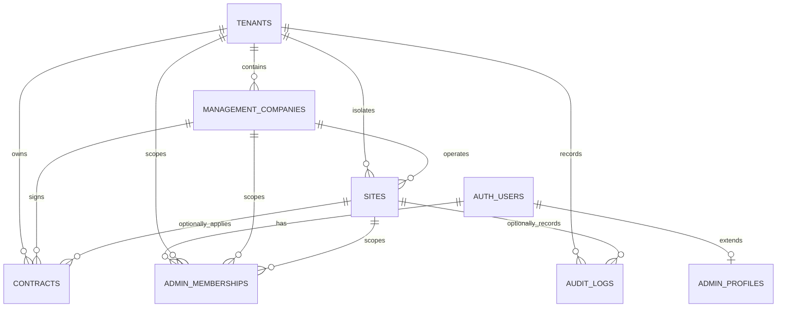

# Taptolk Phase 1 ERD

```mermaid
erDiagram
  AUTH_USERS ||--o| ADMIN_PROFILES : extends
  AUTH_USERS ||--o{ ADMIN_MEMBERSHIPS : has
  TENANTS ||--o{ MANAGEMENT_COMPANIES : contains
  TENANTS ||--o{ SITES : isolates
  TENANTS ||--o{ CONTRACTS : owns
  TENANTS ||--o{ ADMIN_MEMBERSHIPS : scopes
  TENANTS ||--o{ AUDIT_LOGS : records
  MANAGEMENT_COMPANIES ||--o{ SITES : operates
  MANAGEMENT_COMPANIES ||--o{ CONTRACTS : signs
  MANAGEMENT_COMPANIES ||--o{ ADMIN_MEMBERSHIPS : scopes
  SITES ||--o{ CONTRACTS : optionally_applies
  SITES ||--o{ ADMIN_MEMBERSHIPS : scopes
  SITES ||--o{ AUDIT_LOGS : optionally_records
```

Every relationship between tenant-owned entities includes `tenant_id` in its database foreign
key even when the diagram shows only the business relationship.
